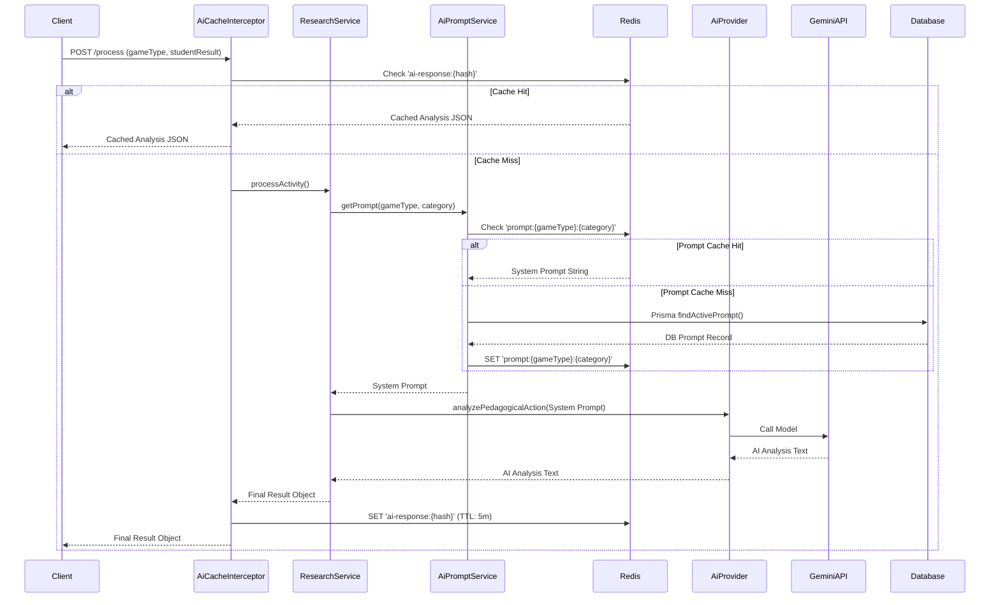

# CACHE_STRATEGY

## Architecture Overview

The AI Processing API uses a dual-layer Redis caching strategy to minimize latency and reduce unnecessary API calls to the Google Generative AI (Gemini) endpoint.



## Cache Layers

### 1. AI Response Cache (AiCacheInterceptor)
Caches the full, generated response from Gemini for a specific set of inputs. Since students might provide the exact same answer to the same exercise multiple times, caching this prevents redundant API calls.

- **Store**: Redis
- **Key Format**: `ai-response:{sha256_hash_of_request_body}`
- **Default TTL**: 300 seconds (5 minutes)
- **Config Variable**: `CACHE_TTL_SECONDS`

### 2. Prompt Cache (AiPromptService)
Caches the system prompts fetched from the PostgreSQL database via Prisma. System prompts change rarely, so fetching them from DB on every single AI request adds unnecessary latency.

- **Store**: Redis
- **Key Format**: `prompt:{gameType}:{category}`
- **Default TTL**: 600 seconds (10 minutes)
- **Config Variable**: `PROMPT_CACHE_TTL_SECONDS`

## Configuration

Environment variables defined in `.env`:

| Variable | Description | Default |
|---|---|---|
| `REDIS_HOST` | Redis server hostname | `localhost` |
| `REDIS_PORT` | Redis server port | `6379` |
| `CACHE_TTL_SECONDS` | Time-to-live for AI response cache | `300` |
| `CACHE_MAX_ENTRIES` | Max entries in cache (if using memory fallback) | `100` |
| `PROMPT_CACHE_TTL_SECONDS` | Time-to-live for system prompt cache | `600` |

## Cache Invalidation

Currently, system prompts are invalidated automatically via TTL expiration (every 10 minutes).
If immediate invalidation is required (e.g., an admin updates a prompt in a dashboard), the application can call:

```typescript
await aiPromptService.invalidatePromptCache(gameType, category);
```

## Troubleshooting & Monitoring

To monitor cache hits and misses in real-time, connect to the Redis container:

```bash
docker exec synapxix-redis redis-cli monitor
```

To see all cached keys:

```bash
docker exec synapxix-redis redis-cli keys "*"
```

If Redis is down, the NestJS `CacheModule` will log an error but the `AiCacheInterceptor` is designed to "fail-open", meaning the request will simply bypass the cache and hit the AI directly, ensuring system availability.
