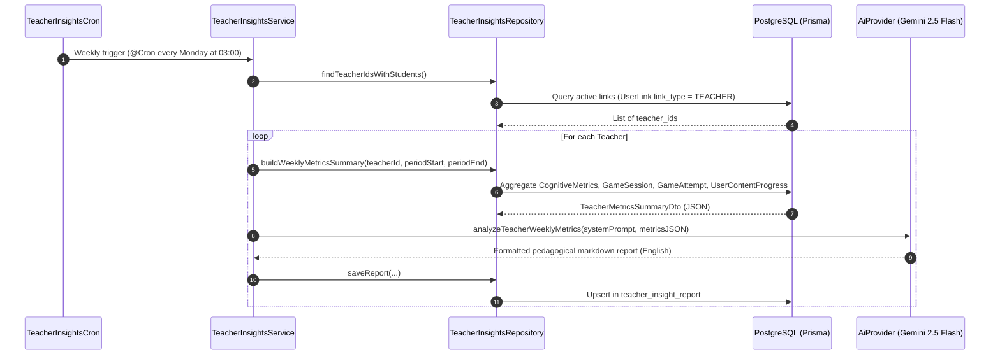

# Module: Teacher Insights (AI-Assisted Teacher Insights)

## 📌 Overview
The `TeacherInsights` module is a background worker and REST API service in NestJS responsible for generating **automated weekly pedagogical reports** for teachers using Artificial Intelligence (Gemini 2.5 Flash).

It aggregates cognitive metrics, exercise success rates, and content progress for a teacher's assigned student group over the previous week (ISO Monday-to-Monday window), injects the structured JSON data into `AiProvider`, and persists the resulting recommendations in PostgreSQL for consumption on the teacher's Dashboard.

---

## 🏗️ Architecture and Components

```
teacher-insights/
├── dto/
│   ├── teacher-insights-report-response.dto.ts # Structured REST API response DTO
│   └── teacher-metrics-summary.dto.ts          # Aggregated metrics JSON structure (injected into AI)
├── test/
│   ├── teacher-insights.controller.spec.ts     # Unit tests for REST controller and RBAC authorization
│   ├── teacher-insights.cron.spec.ts           # Unit tests for scheduled background worker
│   ├── teacher-insights.repository.spec.ts     # Unit tests for Prisma database aggregations
│   └── teacher-insights.service.spec.ts        # Unit tests for orchestration and error handling
├── README.md                                   # Complete technical module documentation
├── teacher-insights.controller.ts              # HTTP API endpoints (GET / POST) protected by JWT
├── teacher-insights.cron.ts                    # Scheduled background worker (@nestjs/schedule)
├── teacher-insights.module.ts                  # NestJS module with dependency injection
├── teacher-insights.repository.ts              # Multi-table aggregations and Prisma persistence
└── teacher-insights.service.ts                 # Flow orchestrator with AiProvider & AiPromptService
```

---

## ⚡ Key Architectural Features & Implementation Details

### 1. Resilience, Idempotency, and Fault Tolerance
- **Isolated Batch Processing**: In `generateWeeklyReportsForAllTeachers()`, a failure in report generation for one teacher does not interrupt or abort processing for other teachers.
- **Idempotent Writes via Upsert**: Database writes use `upsert` bound to the composite unique key `(teacher_id, period_start, period_end)`. This allows cron re-runs or manual triggers without duplicate records or constraint violations.
- **Exponential Backoff in AI Provider**: `AiProvider` wraps Google Gemini 2.5 Flash calls with `withRetry`, automatically handling rate limits (HTTP 429) or transient outages (HTTP 500, 503).

### 2. Security and Role-Based Access Control (RBAC)
- **Data Ownership Verification**: In `assertCanAccess()`, a user with role `user` can only read reports matching their own `user_id` (`req.user.sub === teacherId`).
- **Staff / Admin Privileges**: Only users with role `admin` can view reports for other teachers or trigger manual report generation (`POST /:teacherId/generate`).

### 3. Multi-Dimensional Metric Aggregation
The repository aggregates 3 core performance dimensions from PostgreSQL:
- **Cognitive Metrics**: Averages for accuracy (`accuracy`), reaction time (`reaction_time`), cognitive load (`cognitive_load`), memory retention (`memory_retention`), and attention span (`attention_span`).
- **Game Attempts**: Total attempts, success rate, average score, quick completion rate, and breakdown by game type (`MATH`, `READING`, etc.).
- **Content Progress**: Class average progress and title resolution for the **Top 5 struggling topics** (`strugglingContent`).

### 4. Dynamic & Versioned Prompts
- Integrates with `AiPromptService`, allowing retrieval of active, versioned system prompts from database (`ai_prompt`), with an automatic fallback to standard English pedagogical prompt instructions.

---

## ⚙️ Workflow Sequence



---

## 🗄️ Database Schema

### Model: `TeacherInsightReport` (`schema.prisma`)
```prisma
model TeacherInsightReport {
  report_id       String    @id @default(uuid()) @db.Uuid
  teacher_id      String    @db.Uuid
  period_start    DateTime
  period_end      DateTime
  student_count   Int       @default(0)
  active_students Int       @default(0)
  metrics_summary Json
  report_text     String    @db.Text
  status          String    @default("GENERATED") @db.VarChar(20)
  created_at      DateTime  @default(now())

  teacher app_user @relation("TeacherToInsightReports", fields: [teacher_id], references: [user_id], onDelete: Cascade)

  @@unique([teacher_id, period_start, period_end])
  @@index([teacher_id, created_at])
  @@map("teacher_insight_report")
  @@schema("core")
}
```

---

## 🔌 REST API Endpoints

All endpoints are protected by `JwtAuthGuard`.

### 1. Fetch Teacher Report History
- **HTTP Method**: `GET /api/teacher-insights/:teacherId`
- **Query Parameters**: `limit` (optional, number of reports to return, default 12)
- **Permissions**: Target teacher (`req.user.sub === teacherId`) or `admin` role.
- **200 OK Response**:
  ```json
  [
    {
      "reportId": "f47ac10b-58cc-4372-a567-0e02b2c3d479",
      "teacherId": "11111111-1111-1111-1111-111111111111",
      "periodStart": "2026-08-01T00:00:00.000Z",
      "periodEnd": "2026-08-08T00:00:00.000Z",
      "studentCount": 15,
      "activeStudents": 12,
      "reportText": "### General Summary\nThe class has demonstrated strong overall performance...",
      "status": "GENERATED",
      "createdAt": "2026-08-08T03:00:00.000Z"
    }
  ]
  ```

### 2. On-Demand Generation (QA / Backfill)
- **HTTP Method**: `POST /api/teacher-insights/:teacherId/generate`
- **Permissions**: Target teacher or `admin` role.
- **210 Created Response**: Returns the newly generated report DTO.

---

## 🧪 Unit Testing

Run the module unit test suite:
```bash
npx jest server/src/app/modules/research/teacher-insights
```
