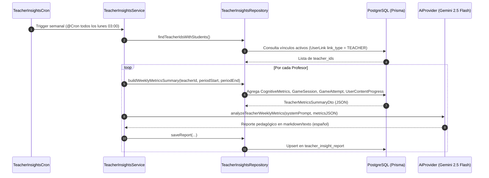

# Módulo: Teacher Insights (Insights Docentes Asistidos por IA)

## 📌 Descripción General
El módulo `TeacherInsights` es un servicio en segundo plano y API REST en NestJS encargado de generar **reportes pedagógicos semanales automáticos** para profesores mediante Inteligencia Artificial (Gemini 2.5 Flash).

Compila las métricas cognitivas, tasas de éxito en ejercicios y progreso en contenidos del grupo de alumnos vinculados a un docente durante la semana transcurrida (ventana ISO de lunes a lunes), inyecta la información estructurada en `AiProvider` y persiste las recomendaciones resultantes en la base de datos PostgreSQL para su consumo en el Dashboard del docente.

---

## 🏗️ Arquitectura y Componentes

```
teacher-insights/
├── dto/
│   ├── teacher-insights-report-response.dto.ts # DTO de respuesta estructurada para la API REST
│   └── teacher-metrics-summary.dto.ts          # Estructura de métricas agregadas (JSON inyectado a IA)
├── test/
│   ├── teacher-insights.controller.spec.ts     # Pruebas unitarias del controlador REST y RBAC
│   ├── teacher-insights.cron.spec.ts           # Pruebas unitarias del worker en segundo plano
│   ├── teacher-insights.repository.spec.ts     # Pruebas unitarias de agregaciones Prisma
│   └── teacher-insights.service.spec.ts        # Pruebas unitarias de orquestación y tolerancia a fallos
├── README.md                                   # Documentación técnica completa del módulo
├── teacher-insights.controller.ts              # Endpoints HTTP (GET / POST) protegidos por JWT
├── teacher-insights.cron.ts                    # Worker programado en segundo plano (@nestjs/schedule)
├── teacher-insights.module.ts                  # Módulo NestJS con inyección de dependencias
├── teacher-insights.repository.ts              # Consultas de agregación multitabla y persistencia Prisma
└── teacher-insights.service.ts                 # Orquestador del flujo con AiProvider y AiPromptService
```

---

## ⚡ Aspectos Clave de Implementación y Arquitectura

### 1. Resiliencia, Idempotencia y Tolerancia a Fallos
- **Batch Processing Aislado**: En `generateWeeklyReportsForAllTeachers()`, la falla en la generación del reporte de un profesor no interrumpe el procesamiento de los demás docentes.
- **Idempotencia por Upsert**: Las escrituras en base de datos utilizan `upsert` basado en la clave única compuesta `(teacher_id, period_start, period_end)`. Esto permite reejecuciones del cron o disparos manuales sin duplicar registros ni violar restricciones.
- **Backoff Exponencial en IA**: `AiProvider` envuelve las llamadas a Gemini 2.5 Flash en `withRetry`, manejando automáticamente errores de límite de cuota (HTTP 429) o caídas del servicio (HTTP 500, 503).

### 2. Seguridad y Control de Acceso (RBAC)
- **Verificación de Propiedad de Datos**: En `assertCanAccess()`, un usuario con rol `user` solo puede leer reportes asociados a su propio `user_id` (`req.user.sub === teacherId`).
- **Permisos de Staff/Admin**: Los usuarios con rol `teacher` o `admin` pueden consultar reportes de cualquier docente y son los únicos autorizados para ejecutar la generación manual on-demand (`POST /:teacherId/generate`).

### 3. Agregación Multidimensional de Métricas
El repositorio compila simultáneamente 3 dimensiones clave del rendimiento estudiantil:
- **Métricas Cognitivas**: Promedios de precisión (`accuracy`), tiempo de respuesta (`reaction_time`), carga cognitiva (`cognitive_load`), retención de memoria (`memory_retention`) y nivel de atención (`attention_span`).
- **Métricas de Juego**: Total de intentos, tasa de aciertos, puntuación promedio, velocidad de completado y desglose por tipo de juego (`MATH`, `READING`, etc.).
- **Progreso en Contenidos**: Progreso promedio del grupo y resolución de nombres para los **Top 5 temas con mayor dificultad** (`strugglingContent`).

### 4. Prompts Dinámicos y Versionados
- Se integra con `AiPromptService`, permitiendo recuperar instrucciones del sistema versionadas y activas desde la base de datos (`ai_prompt`), con fallback automático a instrucciones pedagógicas estándar en español.

---

## ⚙️ Flujo de Trabajo (Workflow)



---

## 🗄️ Esquema de Base de Datos

### Modelo: `TeacherInsightReport` (`schema.prisma`)
```prisma
model TeacherInsightReport {
  report_id       String    @id @default(uuid()) @db.Uuid
  teacher_id      String    @db.Uuid
  period_start    DateTime
  period_end      DateTime
  student_count   Int       @default(0)
  active_students Int       @default(0)
  metrics_summary Json
  report_text     String    @db.Text
  status          String    @default("GENERATED") @db.VarChar(20)
  created_at      DateTime  @default(now())

  teacher app_user @relation("TeacherToInsightReports", fields: [teacher_id], references: [user_id], onDelete: Cascade)

  @@unique([teacher_id, period_start, period_end])
  @@index([teacher_id, created_at])
  @@map("teacher_insight_report")
  @@schema("core")
}
```

---

## 🔌 API REST Endpoints

Todos los endpoints están protegidos por `JwtAuthGuard`.

### 1. Consultar Historial de Reportes
- **HTTP Method**: `GET /api/teacher-insights/:teacherId`
- **Query Parameters**: `limit` (opcional, número de reportes a retornar, por defecto 12)
- **Permisos**: Propio profesor o usuarios con rol `admin`.
- **Respuesta 200 OK**:
  ```json
  [
    {
      "reportId": "f47ac10b-58cc-4372-a567-0e02b2c3d479",
      "teacherId": "11111111-1111-1111-1111-111111111111",
      "periodStart": "2026-08-01T00:00:00.000Z",
      "periodEnd": "2026-08-08T00:00:00.000Z",
      "studentCount": 15,
      "activeStudents": 12,
      "reportText": "### Resumen General\nLa clase ha mostrado un excelente desempeño...",
      "status": "GENERATED",
      "createdAt": "2026-08-08T03:00:00.000Z"
    }
  ]
  ```

### 2. Generación On-Demand (QA / Backfill)
- **HTTP Method**: `POST /api/teacher-insights/:teacherId/generate`
- **Permisos**: Exclusivo para usuarios con rol `teacher` o `admin`.
- **Respuesta 201 Created**: Devuelve el DTO del reporte recién generado.

---

## 🧪 Pruebas Unitarias

Ejecución de la suite completa de pruebas unitarias del módulo:
```bash
npx jest server/src/app/modules/research/teacher-insights
```
## Perez Sofia