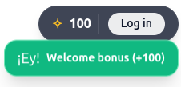

# MB-402
#### Cognitas
- This module implements an "observer" + notifications (signals).
-------------------------------------------------------------------------------------------------
 ### Services + Components
 
 
 #### balance.service.ts 
 It is a centralized service that manages the Cognitas for the entire app. I used `signal` and `asReadonly` so the balance cannot be modified "from the outside" without going through the official method.
 * The `updateBalance` method is dedicated to adding points and also triggers a notification event (auto-clears after 5 seconds).

 #### auth-widget.component.ts 
 * Currently, it has a phrase that I plan to rearrange to show something more significant, but ideally, it should display something more related to the game.
 Beyond this, it is dedicated to detecting when there is a new reward and displaying an animated toast using Tailwind CSS.
 
 - Tracking Logs:
 Technical marker to track balance updates in real-time.

 ------------------------------------------------------------------------------------------------
 #### notification
 It is a "toast" type that appears dynamically below the main widget: the component observes the service's signal and updates the counter.
 - The toast uses the Tailwind `animate-bounce` class to capture the user's attention when receiving a bonus.
 ------------------------------------------------------------------------------------------------

 #### Test
 The component was tested; it receives a reward object (in this case, upon entering the game just for verification), displays a "welcome bonus" message, and auto-clears after the timeout. 

 

 ------------------------------------------------------------------------------------------------
 For now, I conclude with:
 - Creation of BalanceService with signals.
 - Dependency injection in `auth-widget.component.ts`.
 - Layout update (Tailwind CSS + Flexbox).
 - Notification logic.
 - Test.

 To verify, you only need to start the server (`npx nx serve web-game`) and it can be visualized until it is better positioned.

 ### Perez, Sofia.